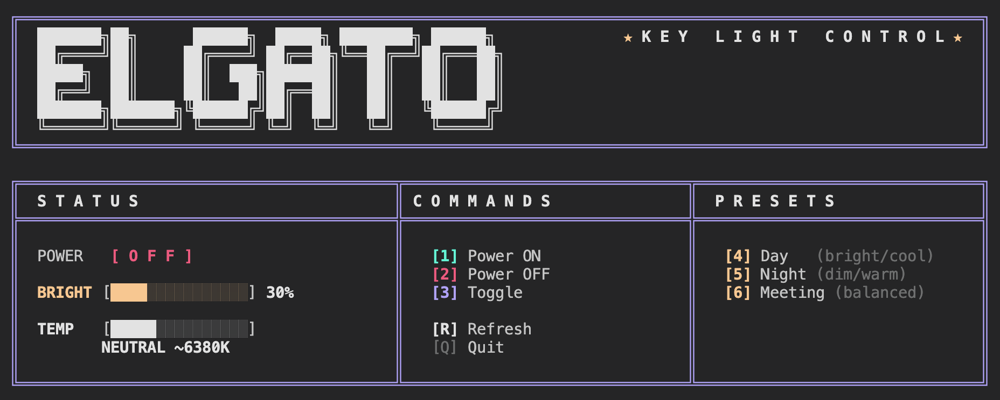

# elgatui

A retro-styled terminal UI for controlling Elgato Key Light devices.



## Setup

### 1. Find Your Key Light IP Address

Open the Elgato Control Center app and navigate to:

**Accessory Settings > [Your Light] > Advanced**

The IP address will be displayed there (e.g., `192.168.68.78`).

> **Note:** It's recommended to assign a static IP address to your Key Light in your router's DHCP settings. This prevents the IP from changing and breaking the connection.

### 2. Configure the IP Address

Edit `config.sh` and set your Key Light's IP address:

```bash
ELGATO_IP="192.168.68.78"  # Replace with your IP
ELGATO_PORT="9123"         # Default port, usually no need to change
```

### 3. Configure Presets

The controller includes three presets you can customize in `config.sh`:

```bash
# Brightness: 0-100
# Temperature: 143 (warm/2900K) to 344 (cool/7000K)

# Day - bright and cool for daytime work
PRESET_DAY_BRIGHTNESS=80
PRESET_DAY_TEMPERATURE=280

# Night - dim and warm for evening
PRESET_NIGHT_BRIGHTNESS=25
PRESET_NIGHT_TEMPERATURE=160

# Meeting - balanced for video calls
PRESET_MEETING_BRIGHTNESS=30
PRESET_MEETING_TEMPERATURE=220
```

## Usage

### Interactive Menu

Run without arguments to launch the interactive menu:

```bash
./elgatui
```

Press keys 1-6, R, or Q to control the light - no Enter key required.

### Command Line

```bash
./elgatui on        # Turn on
./elgatui off       # Turn off
./elgatui toggle    # Toggle on/off
./elgatui day       # Apply Day preset
./elgatui night     # Apply Night preset
./elgatui meeting   # Apply Meeting preset
./elgatui status    # Show current status
./elgatui set 50 200  # Set brightness 50%, temperature 200
```

## Requirements

- Bash
- curl
- Elgato Key Light on the same network
